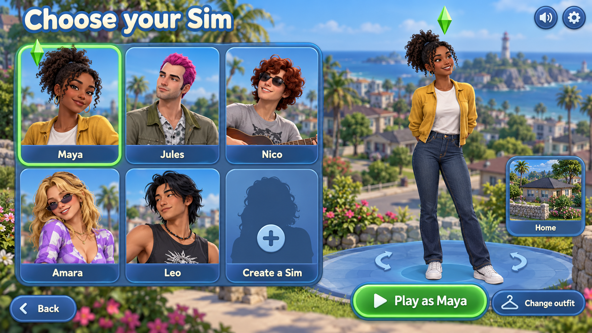
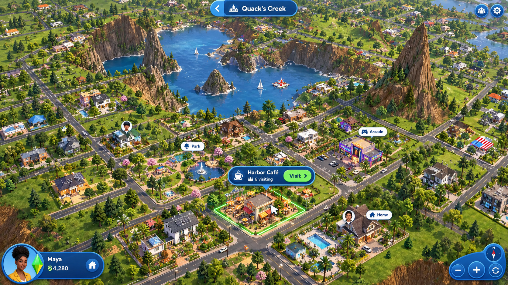
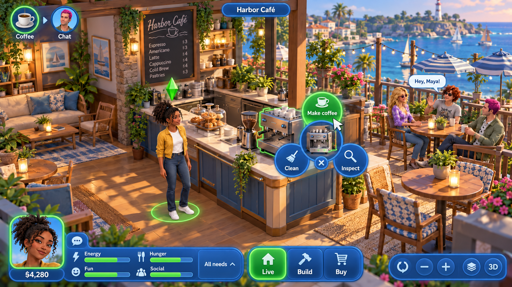

# Action-focused Wonderland interface

These are the three design references approved by the project owner on 5 October 2026. They establish the visual direction and player actions. They are design illustrations, not screenshots of a running 3D engine.

## Choose a character

Select a large portrait, see the full character on a stage, and play. Character identity and the primary action lead; account/profile forms do not replace character selection.

## Choose a destination

Tap a building on the world map. The selected place shows a compact Visit action attached to its location. Preserve the world as the main screen.

## Act in the world

Select the coffee machine to reveal its actions beside the object. Show the queue and a compact needs HUD while leaving the scene visible. Four summary meters have labels, with all eight needs available on demand.

## Implementation boundary

The first increment introduces a Rust/Leptos browser shell, a pure state layer, versioned UI fixtures, and an illustrated presentation adapter. Its primary controls are actual semantic DOM elements and state transitions, separate from these reference images. The runtime art is generated independently with no embedded UI; see [asset provenance](../../../apps/web-shell/public/assets/ASSETS.md).

Production 3D camera and picking, character animation, simulation, server-authorized actions, content imports, account flows, and build/buy remain integration work. Their UI direction is preserved here without claiming the illustration implements those systems.

The detailed [first increment specification](../../superpowers/specs/2026-10-05-action-first-browser-ui.md) and [implementation plan](../../superpowers/plans/2026-10-05-action-first-browser-ui.md) define the scope and acceptance checks.

## Character and Home increment

The next increment extends this same visual family with a character-stage creator, whole-look wardrobe choices, and a distinct Home scene. Buy uses an illustrated catalog and direct floor placement; Build selects existing furniture for Move/Rotate/Store, while inventory preserves owned-instance identity. Drafts preview immediately, and confirmed profile, outfit, room and budget changes come from typed provider outcomes.

The [character and Home specification](../../superpowers/specs/2026-10-05-character-and-home-ui.md) defines the bounded local preview, persistence and accessible actions. The [cross-swarm integration handoff](../../integration/character-home-ui-handoff.md) records the inspected simulation/content interfaces and remaining live-service/renderer adapters. This addition covers preview room arrangement; architecture construction and production 3D remain separate work.
