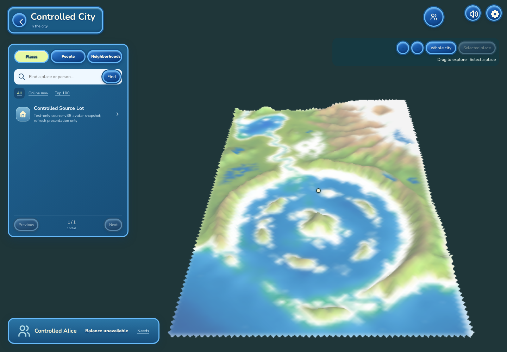
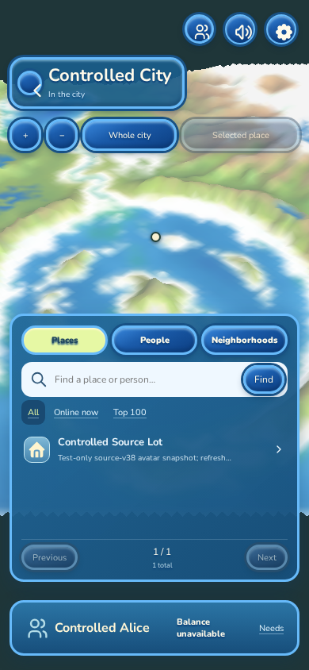
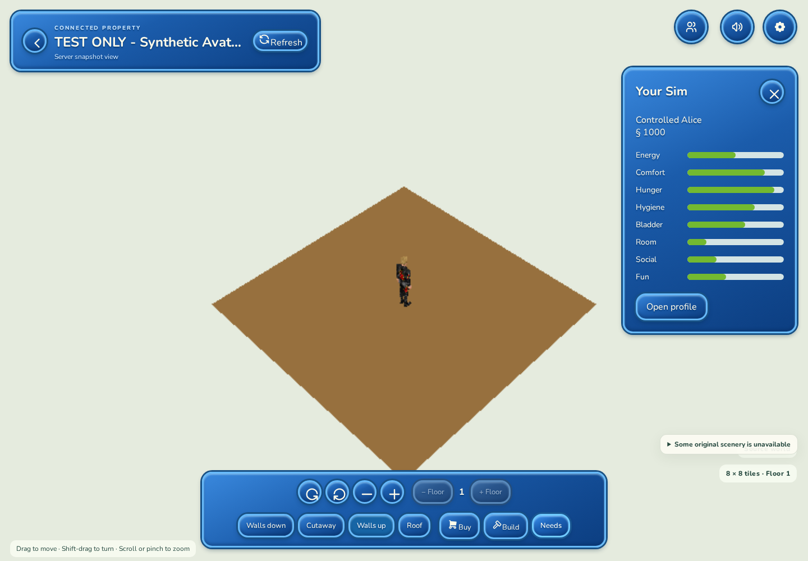
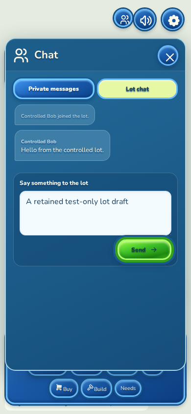
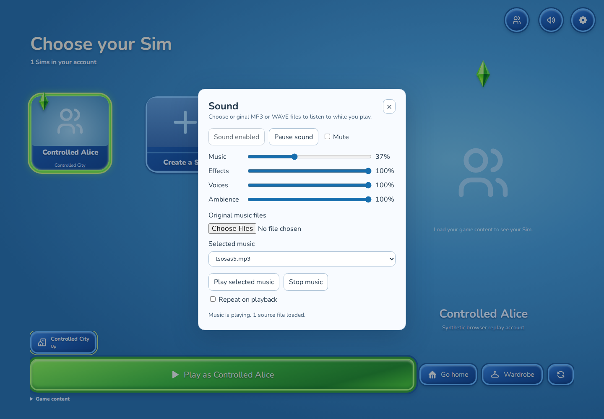
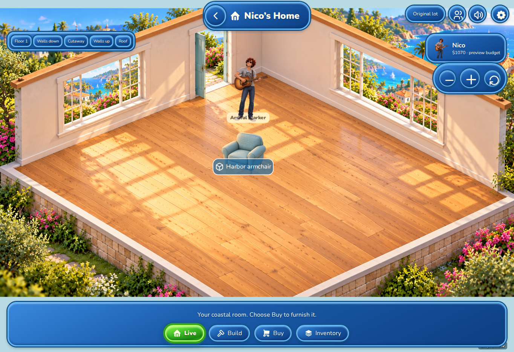

# Connected continuation gallery

These unedited Chromium captures show the continuation from
[PR #18](https://github.com/rndrntwrk/wonderland-/pull/18). Connected captures use
the compiled release WASM application, the loopback native replay example, and
an isolated test account. The original terrain and avatar rendering are real; the account,
property snapshot and incoming chat are explicitly synthetic test data.
The final Home capture uses the existing local preview adapter in a separate
fresh context.

Connected desktop captures use a 1440 × 1000 viewport. Narrow captures use Chromium's
390 × 844 mobile/touch emulation, not a physical phone. The
[verification record](connected-continuation.md#verification) describes the
tests and remaining integration work. The [earlier gallery](screenshot-gallery.md)
retains the approved creator, illustrated preview, source lot and saved-roster
evidence from the preceding checkpoint.

## Connected source city on desktop

The original map 0100 terrain occupies the connected scene, alongside the
directory and player controls. Its rendered buffer uses the actual viewport
aspect ratio. The synthetic property has a valid source location and a
selectable terrain pin; selecting that pin and using Visit enters its lot.

## Connected city in a narrow viewport

Terrain extends behind the full mobile scene. The property marker remains
visible above the directory, with camera controls and player navigation
available. This capture verifies the 390 × 844 layout; very short screens
still have limited map space while the directory is open.

## Original avatar resources in the source lot

This deliberately bare 8 × 8 test snapshot renders the exact original Robin
head and leathers body resources loaded separately through Game content.
The avatar uses the original skeleton, mesh, textures and first restored pose.
The original-resource check resolves four mesh parts, 668 triangles and three
textures, and verifies depth picking against the source avatar identity.

The displayed needs use distinct test values to verify all eight source
labels. The profile preserves the corresponding signed source values. A
successful property admission closes its Property panel; Refresh retrieves a
newer snapshot without inventing an action result. This scene does not show
continuous VM simulation or a furnished production lot.

## Incoming native lot chat

The loopback peer sends an original SimJoin followed by Chat from Controlled
Bob. The browser shows the join notification and one copy of the greeting with
its original sender. The typed draft survives closing and reopening the panel.
The draft was not sent, and no real people were contacted.

## Actual local music playback

The browser loads an original MP3 chosen for the test and advances its media
clock. Pause freezes playback, Resume continues it, Music volume reaches the
media element, Mute silences it, and Stop releases the stream. The screenshot
shows playback at 37% Music volume. This verifies local music audition; the
active lot still needs its original cue, content and camera integration.

## Preserved Home after an accepted purchase and reload

The existing illustrated preview was checked separately at 1364 × 936. Nico
remained the acting Sim through map travel, a coffee-machine action, queue
cancellation and entry to his Home. Buying one Harbor armchair for $180
changed the preview budget from $1,250 to $1,070. After reload and reselecting
Nico, the exact accepted save, armchair instance at cell (2, 2), and $1,070
balance remained, with no duplicate charge. Navigation itself is not persisted.
This isolated test made no gateway or external browser requests and did not
open or change historical user saves.

