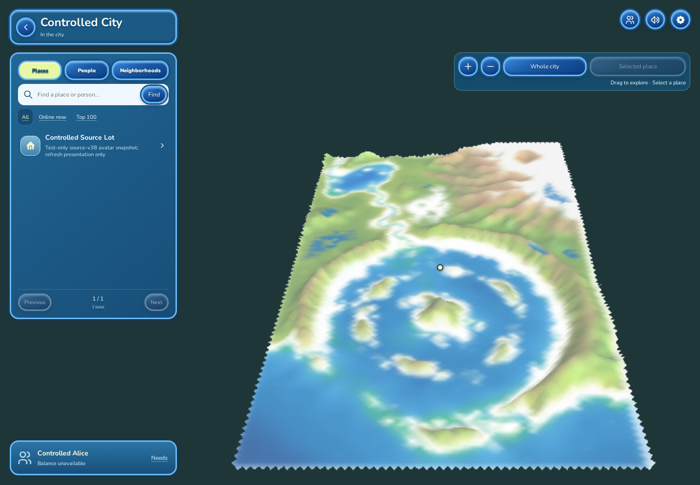
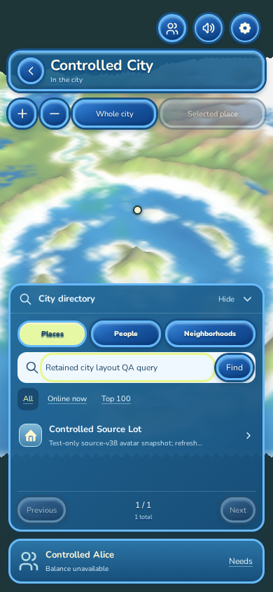
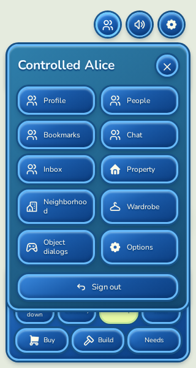
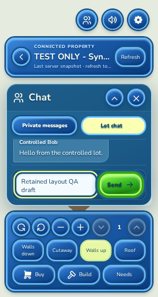
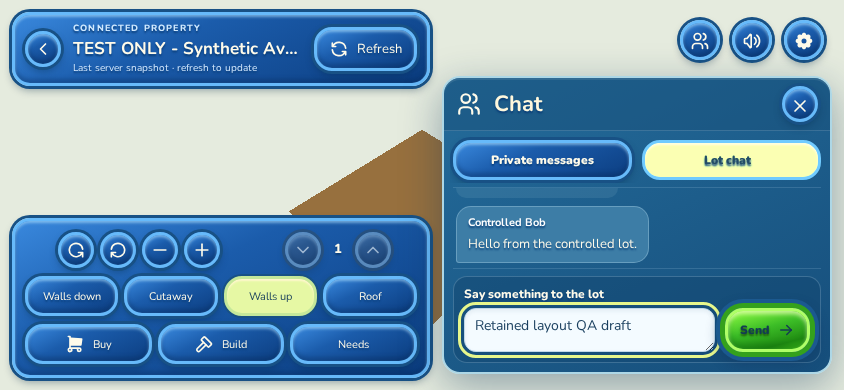
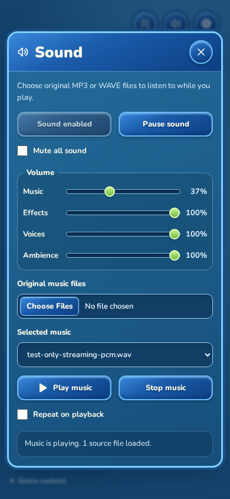
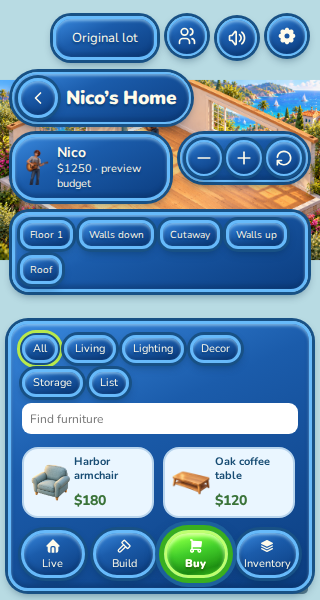
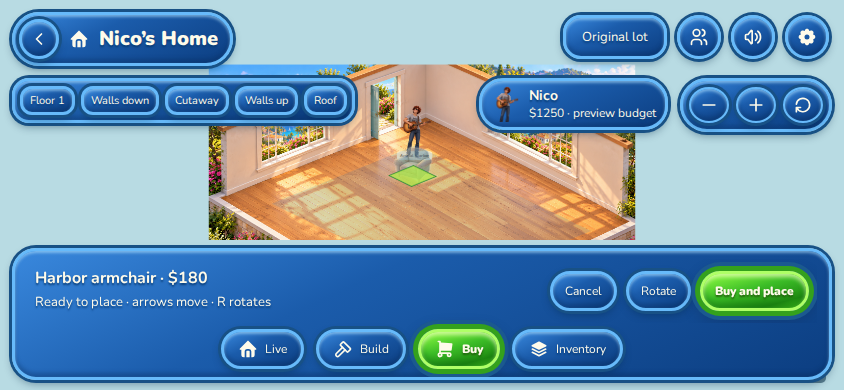
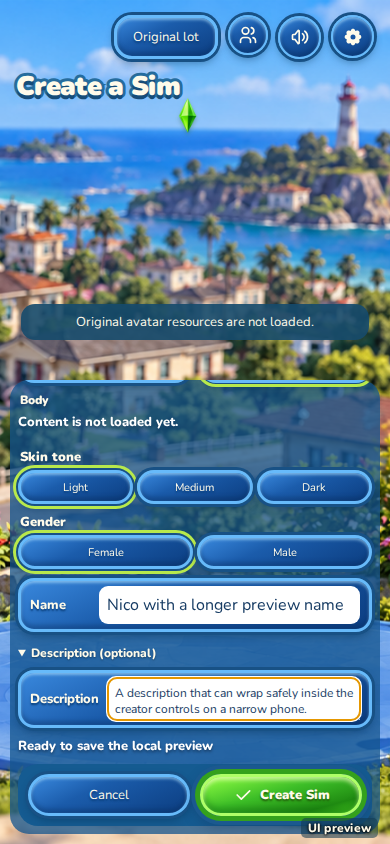

# Connected UI alignment and responsive repairs

This repair is stacked on PR #20 (`67b17cc`). It corrects the visible alignment, sizing and overlap problems in the existing game interface, together with the avatar profile click regression found during review.

## What changed

- Shared controls use explicit icon dimensions and circular button sizes. Panel headers, close actions, menu icons and labels align consistently.
- The connected city title, directory and Sim card share a common edge and width. Phones and short landscape screens start with a compact directory toggle. Search, filters and pagination stay mounted when the directory is hidden; map framing updates with the available space.
- Property controls have separate camera, floor, wall and activity groups. They reflow into aligned rows on phones. Short landscape chat and the property toolbar sit beside each other. Header text truncates within its available space instead of colliding with the panel.
- Chat has a bounded message area and visible composer. The 320px layout keeps both the text field and Send button inside the panel. Drafts, unread handling, scroll state and message limits retain their existing behavior. Expand is omitted where the viewport cannot provide a larger panel.
- Profile facts and the eight needs use aligned label and value columns.
- Sound uses the same blue beveled styling as the game, aligned sliders and percentage columns, equal action pairs, a fixed header and a scrolling body on short screens. Playback policy is unchanged.
- Home and creator layouts fit narrow and short screens. The fixes address the shifted Home header, budget/control collisions, oval camera buttons, crowded mode tabs, catalog wrapping, scrolling Build tools, and focused creator fields hiding beneath the action row.
- Clicking an accepted avatar still opens its profile after an ordinary simulation tick. Stale terrain and object authoring continue to require a fresh snapshot, and source/session identity checks remain enforced.

## Verification

| Check | Result |
| --- | --- |
| Native workspace tests | 1,319 passed; zero failed; five resource/oracle tests remain ignored by default |
| New snapshot picking regressions | Two passed, included in the workspace total |
| Browser audio Node tests | 59 passed; zero failed or skipped |
| Rust formatting and whitespace | Passed |
| Strict native and WASM Clippy | Passed |
| Optimized Trunk release build | Passed |
| Connected browser layout and interaction checks | Passed at 1440×1000, 390×844, 320×600 and 844×390 |
| Home and creator browser checks | 32 rendered states passed across the same four viewports |
| Avatar pixel before/after ordinary tick 43 | Profile opened in both cases; stale terrain editing remained guarded |
| Actual browser streaming audio | Playback, pause, resume, volume, mute, stop, focus return, disposal and preference restoration passed at all four sizes |
| Original `TSOClient/`, `Other/` and dependency lockfile | Unchanged |

The connected checks assert panel containment, fixed top-control dimensions, toolbar-group overflow, exposed property controls, aligned need bars, composer containment, chat/toolbar separation, preserved chat drafts, and directory state across Hide/Show. They run against the built assets without injecting source styles.

[Machine-readable verification and screenshot hashes](connected-ui-repairs-verification.json)

The browser runs use a controlled local gateway and test-only identities. The avatar interaction check uses explicitly synthetic geometry. Audio was exercised with a synthetic streaming WAVE file through the actual media element; the earlier original MP3 check belongs to PR #20. Creator layout checks use its unloaded-content state. These repairs do not establish original artwork fidelity, physical speaker output, cross-browser parity, or continuous VM/gameplay-provider completion. Chromium's existing preload-integrity warning and the pinned dependency's future-compatibility notice remain; expected request cancellations are recorded separately from runtime errors.

## Reproduce the connected checks

Use the repository's pinned Rust toolchain and Trunk. The manual browser check requires Node.js 20+ and an installed Playwright module with Chromium.

```bash
cargo fmt --all -- --check
cargo test --workspace --locked
node --test crates/audio-runtime/browser/*.test.mjs
cargo clippy --workspace --all-targets --locked -- -D warnings
cargo clippy -p wonderland-web-shell --target wasm32-unknown-unknown --lib --bin wonderland-web-shell --locked -- -D warnings
npm --prefix apps/web-shell run build
cargo build -p wonderland-browser-gateway --example controlled_replay
node apps/web-shell/scripts/check-connected-layout.mjs
```

The script documents overrides for the Playwright module, gateway executable, build directory, evidence directory, viewport sizes and loopback ports. It starts its own controlled gateway and retains an unsent draft. It does not target a deployed account or send messages to real people.

## Unedited browser captures

### Connected city — 1440×1000

The city header, directory and Sim card align; map controls have consistent sizing.



### City directory — 390×844

The expanded directory remains inside the viewport. Hiding it restores map space while retaining its state.



### Player menu — 320×600

Menu entries use the same icon column and label alignment, with a contained close control.



### Lot chat — 320×600

The composer stays visible above the property toolbar. This is a test-only snapshot and incoming sender.



### Lot chat — 844×390

The chat panel, header and property controls occupy separate areas in short landscape.



### Sound — 390×844

The fixed header, aligned sliders, readable file controls and paired actions share the game's styling.



### Home Buy — 320×600

Budget, circular camera controls, floor controls, catalog and four mode buttons remain contained.



### Home placement — 844×390

Placement actions remain separate from camera controls and the Home header.



### Creator — 390×844

The focused description clears the sticky action row. Original appearance content is unloaded in this capture.


