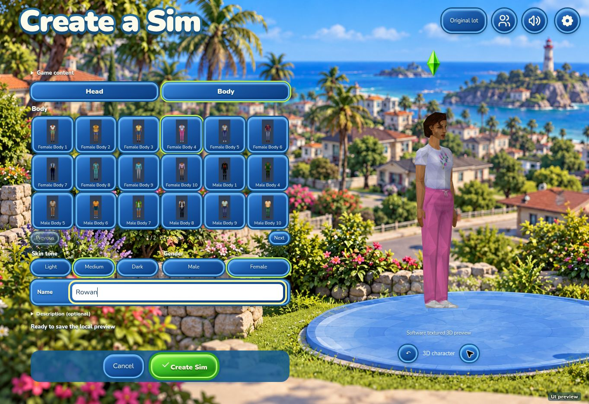
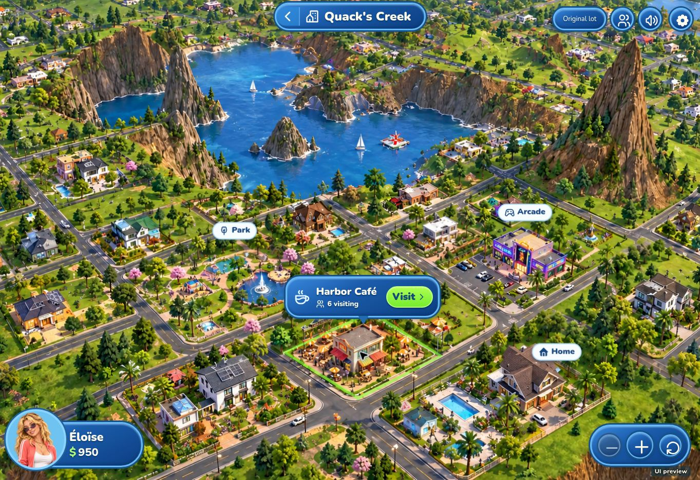
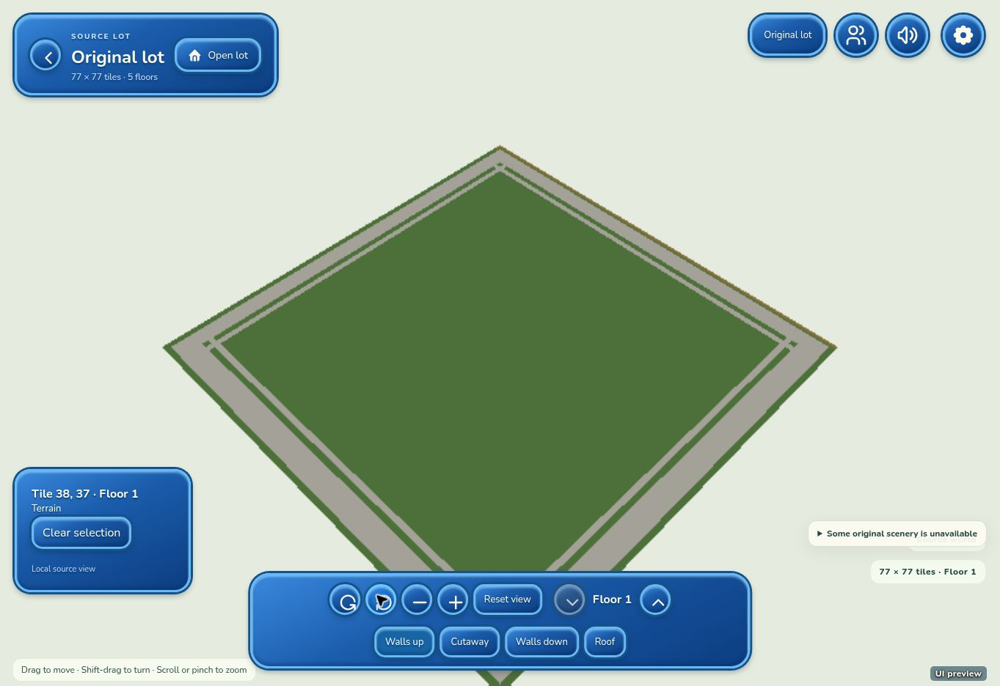
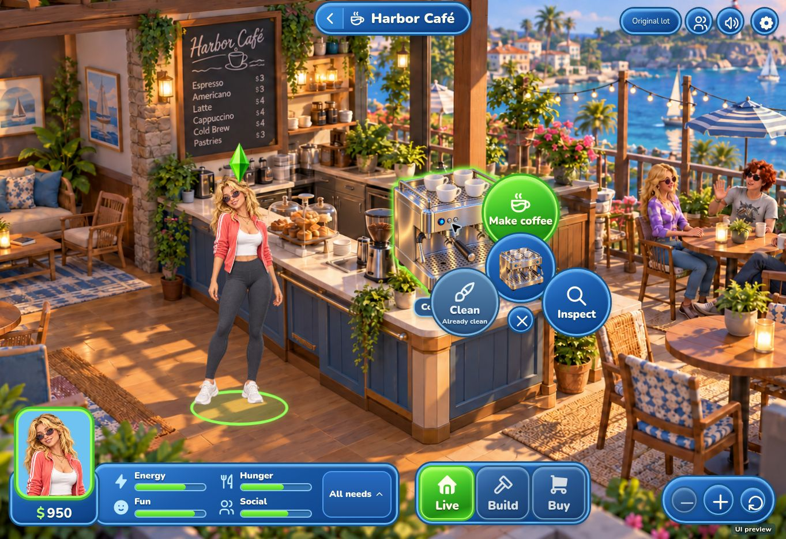
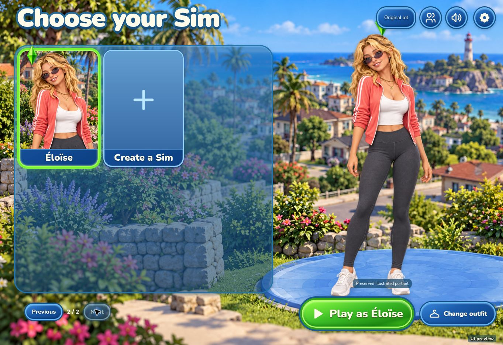
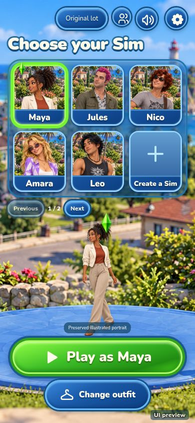

# Browser redesign gallery

These six images are unedited captures from the verified browser release. Their captions identify original-source rendering, the preserved illustrated preview and the scope of each check. The [integration handoff](connected-integration.md) records verification and remaining work. No connected browser account/city/lot journey or deployed-server gameplay is claimed by these images.

## Original-content character creator

The supplied original appearance pack provides independent head/body choices and a rendered character stage. Female Head 3, Body 4 and medium skin were selected, and the character was rotated. The shown Rowan draft was canceled after review; it did not replace a saved Sim.

## Choose a destination

**Illustrated preview:** Éloïse selected Harbor Café on the Quack's Creek map and used Visit. This capture demonstrates the preserved interactive destination flow; it does not show live directory data or the connected source-city terrain renderer.

## Original lot in 3D

**Actual source geometry:** the original empty-lot blueprint is rendered with camera controls and depth-correct tile picking. Floor boundaries from 1 through 5, camera/reset and source-coordinate selection were checked. This is a local source view; unavailable original object models remain diagnosed.

## Actions beside an object

**Illustrated preview:** selecting the coffee machine exposes Make coffee and Inspect, with Clean disabled and its reason shown. These are working preview controls, not evidence that the original network VM executed an interaction.

## Existing Sims remain accessible

**Preserved local save:** the sixth Sim, Éloïse, remains reachable on page 2/2, with the saved §950 budget still available. Roster pagination does not replace the account with five fixed identities.

## Roster in a narrow viewport

A **390 × 844 iframe in desktop Chrome** displayed a three-column roster, six cards including Create, the character stage and Play/Change outfit without observed overlap or clipping. Next reached Éloïse on page 2. This verifies the narrow roster/pagination case; no mobile hardware emulation or other narrow-screen flow was tested.

